What is FIS-B 978?
=====================

**FIS-B 978** ('fisb-978') is a set of programs that demodulates
and error corrects FIS-B
(Flight Information System - Broadcast) and ADS-B
(Automatic Dependent Surveillance - Broadcast)
messages transmitted on 978 Mhz, mostly in the United States.

It performs the same function as
`FlightAware's 978 <https://github.com/flightaware/dump978>`_,
but is spread out over several programs that are piped together.
It's main advantage over FlightAware's 978 and other 'dump-978'
clones is that for moderate to weaker signals it can provide
much higher packet decode rates, since it takes into account
that samples at the Nyquist sampling rate may not be optimal
and will shift them to more optimal levels.

For strong signals, 'dump-978' and 'fisb-978' will perform similarly.

'fisb-978' is composed of two main parts and one optional part:

* **demod_978** is a C language program which takes raw data
  from an SDR program at 978 Mhz and sample rate of 2.083334 Mhz
  (with 16-bit complex integer output (CS16)) and will demodulate
  the data, detect sync words, and output packets along with attributes
  of the packet to standard output. Typically, 'ec-978.py' will
  read this data.
* **ec_978.py** takes the data from 'demod_978' and will use Reed-Solomon
  error correction to produce an output packet as hex bytes (similar to
  'dump-978'). It uses a number of techniques to provide a higher
  packet decode rate. The output is sent to standard output, where is
  can be used as is, or processed by 'server_978'.
* **server_978.py** takes the output from 'ec_978.py' and will provide
  a TCP server where clients can connect and receive the data. It is
  optional if you don't want to serve the data via TCP.

The program is broken into parts for modularity and speed. C is very
fast for searching through the input stream and finding sync packets
(numpy is great at the demodulation part, but horrid at searching
for sync codes).
Python using numpy (and a Reed-Solomon library linked to a C library),
is very quick at error correcting the packets and manipulating them
to provide more optimum bit levels for better error correction rates.

A few things to consider before using:

* Since 'demod_978.c' uses type-punning, *a compiler that is friendly to
  that is required*. GCC is such a compiler. *All code expects little-endian
  byte order*. This will work on most common architectures in use today.
  If needed, big-endian can be added as a future feature.

* 'server_978.py' uses a ``select()`` statement using both sockets and
  file I/O. As such, *this will usually not work on Windows* (it should
  work fine if you are using the 'Linux Subsystem for Linux').

* 'fisb-978' may improve the number of packets you can error correct, 
  but it should be low on your list of improvements that actually
  matter. Nothing beats a good antenna, and a good 978MHz LNA and
  filter. Also, better quality radios are always a plus.

FIS-B 978 is not designed, nor intended,
to be used for any purpose other than fun exploration. 

.. warning::
   FIS-B 978 is **NOT** intended for actual flight use, nor to be used
   as a component of a system for any flight related operations
   (flight planning, etc). It is strictly a fun hobby program with
   many bugs. It is based loosely on draft standards, not actual 
   standards, and has not undergone any formal testing. **DO NOT
   USE OTHER THAN FOR FUN-- NOT FLIGHT!!**

Getting things running
======================

There is not much setup to do. For ``decode_978`` just cd to the
cloned directory and type ``make``. You should see something like: ::

  $ make
  gcc -c -o demod_978.o demod_978.c -I. -O3 -Wall -funroll-loops
  gcc -o demod_978 demod_978.o -I. -O3 -Wall -funroll-loops

There is nothing to do for ``server_978.py``. It should work out
of the box.

``ec_978.py`` requires *numpy*, a C library, and the Reed-Solomon
interface to the C library.

There are lots of ways to install *numpy*. Go to
`numpy.org <https://numpy.org/install/>`_ if you need help. If
you have ``pip3``, just type: ::

 pip3 install numpy

If you going to use ``eye.py`` to generate eye diagrams, you will
need to install *scipy*, *matplotlib*, and *colour* (as well as *numpy*). This can
all be done with: ::

  pip3 install numpy matplotlib scipy colour

For Reed-Solomon, visit
`https://pypi.org/project/pyreedsolomon/ <https://pypi.org/project/pyreedsolomon/>`_.
The best way to install this is **not** with pip3. Make a clone as follows: ::

  # Do the following line only if you have it already installed
  # or think you might.
  sudo pip3 uninstall pyreedsolomon

  git clone --recursive  https://github.com/epeters13/pyreedsolomon.git
  cd pyreedsolomon
  sudo python3 setup.py install
  sudo ldconfig

``ec_978.py`` should now have all the prerequisites installed.

Initial Usage
=============
To use, you just pipe the output from your SDR program to
'demod_978' and then to 'ec_978.py'. Optionally, you can pipe
it to
'server_978.py' if you want to distribute it. Not including
the server will send the output to a terminal, which is a good
place to start.

Here is an example of a script I use for normal decoding (based on the
*SDRplay RSP1A*). It can be found
in ``scripts/sdrplay-demod``: ::

 # Script used for using rx_sdr with sdrplay to capture raw data
 # and send them to demod_978, ec_978, and server_978.
 #
 # You can change the first portion to reflect your SDR radio, but use
 # the following settings:
 #   frequency:          978 MHz
 #   sample rate:        2083334
 #   output type:        Complex 16 bit integer (usually called CS16)
 #
 # If you just want to see decoded output printed, leave off
 # '| ./server_978.py'.
 #
 rx_sdr -d driver=sdrplay -t biasT_ctrl=true,rfgain_sel=1 -g 25 -F CS16 \
  -f 978000000 -s 2083334 - | ./demod_978 | ./ec_978.py | ./server_978.py

Leave off 'server_978.py' when starting, so you can see the output on the
terminal.

You will need to substitute your SDR program and settings. The settings must include
the frequency, sample rate, and output type (*CS16*) shown above. You just pipe
the raw output through 'demod_978' and 'ec_978.py'. This will give you the
decoded hex strings for FIS-B and ADS-B. To serve it remotely, pipe that output to 'server_978.py'.

For an 8-bit *RTLSDR* or *RadarBox 978 FlightStick*, the above command can be modified
as (also found in ``scripts/rtlsdr-demod``): ::

  rx_sdr -d driver=rtlsdr -F CS16 -g 40 -f 978000000 -s 2083334 - \
   | ./demod_978  | ./ec_978.py | ./server_978.py

You won't get the performance out of an 8-bit SDR as you will with something
with a higher bit ADC. Also, for all radios, a good filtered preamp is
the next most important thing after a good antenna. I have found the
`Uputronics 978MHz UAT filtered preamp <https://store.uputronics.com/index.php?route=product/product&path=59&product_id=87>`_
to be an excellent performer. In the United States
you can get them at `AIRSPY.us <https://v3.airspy.us/product/upu-fp978s/>`_
(disclosure: I am not sponsored by any product, nor do I have affiliate links).

When first starting, it is a good idea to explore your setup to find the
best level (minimum signal strength)
for 'demod_978'. By default, 'demod_978' is tuned for FIS-B
and not ADS-B. It will not attempt to filter packets below a certain level.
This is because if the level is set too low, you will get a huge number
of noise packets that match the sync codes, but are just noise.
This minimum level will be lower for ADS-B than for FIS-B.

To see what levels your packets are successfully decoding at, set
the minimum level in 'demod_978' to 0 with the ``-l 0`` argument, and
turn on the *lowest levels* flag in 'ec_978.py' with ``--ll``. 
The ``--ll`` argument will show the lowest level received for FIS-B,
ADS-B short, and ADS-B long. The output is sent to standard error, so
best to pipe standard output to ``/dev/null`` so it doesn't get lost
in decoded packets. For example: ::

  <your SDR program> | ./demod_978 -l 0 | ./ec_978.py --ll >/dev/null
  lowest ADS-B (L) signal: 1.01
  lowest ADS-B (S) signal: 0.63
  lowest FIS-B     signal: 15.66
  lowest FIS-B     signal: 14.52
  lowest FIS-B     signal: 5.69
  lowest FIS-B     signal: 5.66
  lowest FIS-B     signal: 3.77
  lowest FIS-B     signal: 3.48
  lowest FIS-B     signal: 2.23
  lowest ADS-B (S) signal: 0.28
  lowest ADS-B (S) signal: 0.17
  lowest FIS-B     signal: 1.93

In this example, the lowest FIS-B packet was at signal strength 1.93 and the
lowest ADS-B packet was at 0.17. So if you are only interested in FIS-B, the
default level of 0.9 should be fine. For ADS-B, something like 0.1 might work.
This can be set in 'demod_978' with the ``-l`` argument.

It should be noted that the Reed-Solomon error correction in ADS-B and
FIS-B is not a guarantee that a message was decoded *correctly*. Reed-Solomon
has a number of parity bytes (for our purposes, these are bytes, not bits).
So if you have 14 bytes of parity (like in an ADS-B long message), that means it will
detect and correct up to 7 error bytes that it finds, or 14 that you know exist (erasures). Or some
combination of the above. *If the message actually has more errors than this,
all bets are off, and Reed-Solomon may declare that the message is fine
when it isn't*. None of these messages have a CRC code, or other error
detection mechanism to double check that a decode is correct. So if you
decode random noise, it is very possible to get Reed-Solomon certified
garbage packets.

In FIS-B, there is an imperfect mechanism you can use to double check for
a correct message. It isn't perfect, but it is better than nothing.
In FIS-B, each message is made up of UAT Frames. Each frame comes with
a length, and UAT Frames are chained together until the end of the total
message. Either the frames will fit exactly in a message, or they will
end before the end of the message. In which case the remainder of the
message will be zeros. If a message doesn't pass this test, it isn't
valid. Passing this test doesn't mean it's valid either, but the
likelihood is much higher. Currently, because essentially all of the decodes
from ec_978.py are correct, this mechanism is not used as a double check.

Explanation of program output
=============================

Output from ``ec_978.py`` will show three types of packets:
FIS-B, ADS-B long, and ADS-B short. A FIS-B packet will look like: ::

  +38f18185534cb2c01a0000fc308083e0c10705170403145304232207060f060514
  03044b041b2a070e07050c0b0c6302032a0e0f0614030413042b041b321a0000fc3
  08084433318010221120102012a23040b0518090a0912033a231c030910010a095a
  1b04031c09100100094a010a1b04031c1a0000fc3080846d6040010402090305040
  3020b040e050302900103120b0d060403029801020302140d0b0298010b02040504
  0b09281a0000fc3080840067330c130a1b05061d0413040203022304030c4305041
  504031c83020403042d0c3b0405242b1c050e0d140314031a0000fc30808436e508
  190a13040304051c0b1c0b021b08190a1b340b050b1a1b0809000112130c5b110a0
  30809000a230c5b1a03021a0000fc308083e28303050e0706052c03042b044b040d
  0e050c031c4b0423020b0406050f05344b041b0a03020d060f051405047b221a000
  0fc308083ed0d0211320902010a01580100020902015a0130010001001102010a01
  5209181108010011020162092011000108110000000000000000000000000000000
  0000000000000000000000000000000000000000000000000000000000000
  ;rs=0/01:02:01:01:00:03;ss=3.76/-20.1;t=1639224615.144

Note that in reality, all packets are a single line. The examples are broken
up for clarity. The '**+**' at the beginning indicates a FIS-B packet.
ADS-B packets start with '**-**'. 

The actual message is the set of hex characters that follow.

After that, separated by ';', are three items:

* ``rs=`` is about Reed Solomon error correction
  and how many sync bits in the sync preamble didn't match.
  
  In this case
  ``rs=0/`` means that all bits in the sync word matched. This number
  will be from 0 to 4. Each FIS-B and ADS-B packet is preceded by a
  36-bit sync word. 32 of those bits have to be correct for the sync
  word to be considered a match.

  ``01:02:01:01:00:03`` represents the number of Reed-Solomon errors
  corrected in each FIS-B block. FIS-B messages are made up of six
  parts (blocks), each with their own set of error correction bits. Each
  block can have up to 10 errors before it is considered
  uncorrectable. If a packet has more than 10 errors, the number of
  errors will be listed as ``98``. You will see this when printing errors.
  More commonly, you will see something like:
  ``04:99:99:99:99:99``. This implies that the first block of the packet
  was decoded with 4 errors, but the message only had a small amount
  of content. This is
  what you will see with an empty packet (they only contain basically
  the latitude and longitude of the ground station). ``ec_978.py`` looked at
  the packet and determined, by only looking at block 0, that this
  packet is empty. In that case it doesn't even look at the other
  blocks. The '99' means that a packet was not even looked at.

* ``ss=3.76/-20.1`` represents two types of signal strength.
  The first number, ``3.76`` has no units and isn't related
  to anything. It is just a relative indication of the signal strength
  of the sync word. When data is read by ``demod_978``, the demodulated
  data is a set of signed integers. The program keeps a running average
  of the absolute value of the last 72 bits (i.e. a 36 bit sync word
  with a set of bits in between because we are sampling at two samples
  per bit). In order for the program to even check for sync, this value
  must be larger than some threshold. By default this is 0.9, but it
  can be changed with the ``-l`` argument in ``demod_978``. If the
  running average is above 0.9, we will attempt to match a sync word,
  and if we do, this value is recorded as the signal strength.

  The second number, ``-20.1``, is the Received Signal Strength Indication
  (RSSI). It is included solely for those
  programs that are expecting RSSI values similar to those generated by
  ``dump978-fa`` (there is a ``--d978fa`` switch for ``ec_978.py`` that
  will produce output in the exact format used by ``dump978-fa``). It
  is calculated in the same way that ``dump978-fa`` calculates the value
  (which is basically the usual formula of 10 * log10(power) plus a scaler
  divider that approximates the values out of dump978-fa).
  This is a negative number that gets closer to zero with a stronger signal,
  and further away with a weaker signal.
  This number is calculated using the power from the sync word.

  For comparing signal strengths in FISB-978, the first number is the
  preferred value to use. It's linear and based on the absolute amplitude of the
  sync word.

* ``t=1639224615.144`` is the time in UTC seconds past Linux EPOCH
  with the number of milliseconds attached. This value is calculated as
  follows: ``demod_978`` records the time every time it reads from
  the disk (that usually happens 10 times a second). Whenever we decode
  a sync word, we calculate the time by adding 0.48 microseconds per 
  sample for each bit from the time the disk was read, minus 0.48 * 72 bits
  so the time is reflected back to when the sync word was started.

  So why do we care about message arrival times? There are two primary
  reasons. First, having an arrival time allows you to replay
  messages. The most important reason for this are the FIS-B standard
  tests which are nothing more than packet replays.
  The 
  `fisb-decode <https://github.com/rand-projects/fisb-decode>`_
  repository has programs that will essentially turn time back to
  the starting packet time, and then wait in real time until
  the next packet would have been sent, and send it at the
  correct time relative to the original.
  The second reason is that the FAA, probably dating from
  the time reports were sent over low speed teletype circuits, uses
  only partial dates in reports. It is rare to get the year, month,
  day, and clock time, in a single message. Often, you have to use the
  context of when the message was sent to guess at the actual date-time.
  The 'fisb-decode' 
  repository makes heavy use of message times to create JSON messages
  that have a complete ISO-8601 timestamp.
  
  Another interesting thing about messages in FIS-B is that they
  are only sent at specific times. There are 32 channels for sending FIS-B
  messages.
  Each channel has a specific time the message will begin to be transmitted.
  Each second the messages for a specific ground station will
  be sent in 2-4
  different channels (depending on ground station strength),
  but these channels can be predicted if you
  know the correct UTC second. Even stranger is that the FIS-B standard
  was designed such that if GPS goes out, you can use the time delay
  from when a ground station sent a message,
  to the time you received it, and calculate the distance from you to
  the station (known as *pseudoranging*).
  Combine this with distances from other stations and
  you can calculate an approximate location. This concept is part of
  an FAA initiative known as
  *APNT (Alternate Positioning, Navigation, and Timing)*
  [And yes, if you think this through, there are lots of problems
  with UAT location finding, which is why you probably never heard of it].

Failed FIS-B and ADS-B messages will look something like: ::

  #FAILED-FIS-B 1/99:08:99:08:10:99 ss=1.66 t=1639224737.098
  1639224737.098328.F.01663540.1

  #FAILED-ADS-B 2/99 ss=1.66 t=1639229048.478
  1639229048.478000.A.01658613.2

Again, each will be a single line. The ``#`` in the front indicates a
comment. ``fisb-decode`` will ignore this. The data on the line is
similar to what we just discussed. The last portion of the line is
the attribute string that ``demod_978`` passed to ``ec_978.py`` and is
used as part of the filename in case errors are being saved for further
study. In order to get failed error messages, you must supply the ``--ff``
(FIS-B) or ``--fa`` (ADS-B) arguments to ``ec_978.py``.

A long ADS-B message will look like: ::

  -0b28c0ee3879938546c605d6100600c01105eded2ded2d0ad2740300000000000000
  ;rs=0/1;ss=3.29;t=1639226996.293

It starts with a dash. The format is similar to FIS-B except the
``rs=0/1`` reflects 0 sync code errors (as in FIS-B), and one Reed-Solomon
error was corrected.
There is only one Reed-Solomon block
in ADS-B messages, so you
will only see a single number. Not six as in FIS-B.

A short ADS-B message is just like a long one, but shorter! ::

  -00a97c0d3868cd856ac6076910ac2c602800;rs=1/2;ss=3.56;t=1639228834.048

You can use the ``--apd`` (ADS-B partial decode) flag to add a partial decode
to the comments at the end of an ADS-B message. See the documentation for
``ec_978.py`` for further information.

Theory of operation
===================

demod_978
----------

``demod_978`` receives raw FSK data from an SDR radio at the Nyquist limit of
twice the bit rate. With a bit rate of 1.041667 Mhz, the sample
rate is 2.083334 Mhz. Each sample is a complex IQ value with the
real and complex parts being 16 bit integers.

Demodulation is accomplished using the formula: ::

          (i[n-2] * q[n]) - (i[n] * q[n-2])
 sample = ---------------------------------
                 i^2[n] + q^2[n]

 where n is the current sample and n-2 is the sample 2 samples before
       the current sample.

This formula is the equivalent of taking the arctangent and differentiating
it for time. It's simple and fast and doesn't require any arctangent tables
or arctangent calculations. This technique is from Richard Lyons in *Understanding
Digital Signal Processing, Second Edition*. You can find an explanation of this
technique `here <https://www.embedded.com/dsp-tricks-frequency-demodulation-algorithms/>`_.

The denominator of this equation is for scaling. For our calculations
we ignore it. Empirically, you will get slightly more decodes with scaling, but
none that can't be corrected in ``ec_978.py``.

After demodulating the signal we need to match the sync codes. The sync codes
are 36 bit codes and we need to match 32 (or more) out of the 36 bits (32
isn't a magic number-- it just represents a reasonable value between too many
and too few sync code matches).
The sync code for FIS-B is ``0x153225b1d`` and ``0xeacdda4e2`` for ADS-B.
They are actually inverses of each other, so you could calculate the sync for
one, and you would know if the other matched too. Unfortunately, this technique
is much slower than using Brian Kernighan's algorithm for calculating 1 bits 
separately for each sync code. The sync candidate is XOR'ed with the sync word
and the one bits counted. If you get more than 4 ones, you can stop-- it didn't
match.

One quick note: searching for the sync word is very slow using numpy, and is the
reason we have a separate program in C. Numpy is quick for all other operations.

Before we even try to match a sync word, we take the additional step of maintaining
a 72 bit running total of the absolute values of the samples. Sample values when
signal is present are much higher than when only noise is present. In order to
even attempt to match a sync word, we must have a value greater than some number.
In our case, the default (empirically derived) is 900000. To keep things simpler,
all values are presented to the user in millionths. So 900000 is denoted as 0.9.
This value doesn't not apply to other SDR setups or amplifications. The
``demod_978`` program will let the user set this with the ``-l`` argument. It is
probably best to set this to ``-l 0.0`` and look at the results to find the best
level. The ``--ll`` argument in ``ec_978.py`` can help with this. Also note that
'fisb_978', with the default level of 0.9, is tuned for FIS-B, not ADS-B. Levels
of 0.1 (maybe lower) are required for full ADS-B decoding. The trade off for
lower levels is up to a magnitude more garbage noise packets.

Once we have matched a sync code, we will send 8835 32-bit signed integers for a
FIS-B packet and 771 32-bit signed integers for an ADS-B packet. These numbers
include all the bits required for the message, plus the bits in between the
sample bits, plus one extra sample at the beginning and two extra samples at the
end. This will allow ``ec_978.py`` to try some weighted averages to find better
sampling points. 

The packets are preceded by a 36 character string which tells ``ec_978`` information
about the packet to follow. This includes the type (FIS-B or ADS-B), signal strength,
time the packet arrived, and number of mismatched sync bits. The ``demod_978.c``
documentation
contains details on the format of this string. The string is important so that
``ec_978.py`` will know how many bytes to read for the packet.

We send a single length packet for both ADS-B short and ADS-B long packets. Technically,
we could guess at the type since the first five bits of an ADS-B short packet are
zero, but we haven't done error correction yet, so we might be wrong.

What we don't do, and might be a future enhancement, is that once we match a sync
code, we send the data, and then start looking for the next sync after the end
of the packet, not with the next bits. For FIS-B, this isn't an issue, but might
be for ADS-B. One case that is quite common is that one set of bits may match a sync
code, and
the one right next to it (i.e. the 'other' sample in 'every other sample') will
match too. We take care of this by sending enough bits in the packet so ``ec_978.py``
can check the current sample, as well as the sample right after it.

The last thing ``demod_978.py`` does is to send the 36 character string and packet.

A couple of caveats. This program is written for speed. It uses type-punning to
convert between bytes and various size integers. It needs a compiler that allows
this, such as GCC. It also assumes little-endian architectures.

ec_978.py
---------

``ec_978.py`` receives the fixed length string and reads the appropriate
number of bytes for the actual packet. It then turns this into a numpy
array. This array is processed slightly differently for ADS-B and FIS-B
because FIS-B packets contain six different error correction blocks. I
will explain the process for FIS-B packets because ADS-B packets are just
a subset.

We take each block of a FIS-B message and try to apply Reed-Solomon error
correction to it. We do this by taking the packet and turning it into 
three packets. One packet is the original packet, one is the set of bits
before each bit of the current packet, and one is the set of bits after the
current packet. The routine that does this also handles deinterleaving
the blocks. This applies only to FIS-B. FIS-B packets are interleaved to
help minimize the effect of burst errors.

The first task is to try to decode the original packet without any help
from the bits before or after.
This works most of the time. But if that doesn't work, we switch to method
two.

If you are sampling at many times the bit rate, there is a good chance that
one of your samples is close to optimum. When you are sampling at the Nyquist limit
of 2 samples per bit at twice the bit frequency, there is a good chance that
neither of your samples are near optimum. Both are probably some shade of 'meh'.

If you have a very strong signal, that means that the one and zero points
are widely separated and almost any sampling point will work.

If you don't have a strong signal, the one and zero points are closer 
together and you will run into problems if the sampling points are
far off from optimum.

What we do is to use the bits-before and the bits-after to create
essentially a weighted average. We do this for the entire packet
and then try to error correct again. For example, assume we are
using the bits-after at a level of 90%. This means we take each
bit in bit-after, multiply it by 0.9, and add it to the corresponding
bit in the original
sample then divide by two. After we do this for all bits, we try to error correct again.
At any given time, we are using either bits-before or bits-after and a fixed
percentage to 
calculate a new packet.
We are essentially nudging the sample bits toward either bits-before
or bits-after to find a better sampling point.

After lots of experiments, a table was derived ordering the percentages
and whether they are bits-before or bits-after in an order which will
decode a packet the quickest. For FIS-B, if we decode a packet at a
particular shift level, we will start with that shift level for the next block.

There are other techniques we could do, but are not currently using
(mostly because what we do now works and is fast enough) such as using zero
crossing to estimate a guess on the percentage to use.

It is very uncommon that it takes more than two or three attempts to
decode a packet if the packet is going to decode at all.

If we didn't decode the block, we repeat the process by using the
next set of bits. In other words, bits-after becomes the current
bits, the current bits become the bits-before, and the bits after
the original bits-after becomes the new bits-after. This will result
in a small number of additional decodes.

Anytime we decode block 0, we check it to see if it is an empty packet,
or it ends somewhere in block 0. If it does, we are done and can just
fill all the other blocks with zero.

If we fail decoding, we call this same routine to check for early packet
ending, but for blocks beyond block 0. This checking doesn't apply to
ADS-B.

If we decode all six blocks we create an output string and send it to
standard output.

If the packet doesn't decode, we then try some other techniques. Before
talking about them, lets discuss what we don't do.

Much effort was put into a number of techniques that didn't work out.
The first of these is *erasures*. Erasures are the siren song of
Reed-Solomon. They allow you to specify what parts of the message you think 
are bad. In FIS-B, Reed-Solomon will find and correct up to 10 errors,
or detect up to 20 errors (without correction).
This is called the Singleton Bound.
You can signal a Reed-Solomon decoder to ignore up to 20 bytes that you think
are in error. These bytes are the erasures. Typically, if you specify
something like 6 erasures, that leaves (20 - 6) / 2, or 7 errors that Reed-Solomon
can still detect and correct.
So the thought is to find the
values closest to zero and declare those as erasures.
If your message has less than 20 errors, error correction and erasure
specification will work great. But if your message has more than this, all
bets are off. Adding erasures to a message with more errors than the
Singleton Bound will often return a corrected message that is 
total garbage. In fact, if you add enough erasures, you can get most anything
to decode. But it won't decode correctly.

In our case, we would only try to resort to erasures when the initial decode failed
at >10 errors. We are then betting that we have 20 or less errors and
can replace some of the '*find and correct automatically bytes*' with '*erasure
bytes*' (there is 1:2 ratio). And if the message did have less than
20 total errors, this would
work. But we have no idea how many errors a message has. And we 
don't have a good way to check a repaired packet for accuracy. So we abandoned
using erasures.

Another technique we tried was expanding on our technique of shifting the
bits back and forth to find a better sampling point. You can think of this
as horizontal shifting. We added vertical shifting and combined the two.
Vertical shifts can nudge bits around zero up or down. Looking at graphs
of signals you see a number of cases where this is a problem. In the end,
we had the same problem: we could get corrections but couldn't verify their
correctness. If FIS-B had an alternative check, like CRC, we could probably
get a much higher success rate because we could double check with another
method. But it doesn't, so we can't.

So what to do?

We can't use erasures, but we can change data to what we know is true (or
almost certain to be true). The easiest example of this is block 0 of
FIS-B. The first 8 bytes has a number of bits that are always the same.
So we can change the packet to reflect this before we try to error
correct it. Similarly, if we are a fixed station and only getting one,
or at most a few ground stations, we know what the first six bytes will
be. So we can try those. The '``--f6b``' flag in ec_978.py will let us 
set these values. Often, these two techniques alone will allow us to
decode FIS-B block 0.
Many FIS-B messages only have actual content in block 0 (i.e. they are
short messages and the rest of the message are zeros).
So by decoding block 0 of a short message, we have avoided having to decode
the other blocks.

Another technique is to detect running zeros at the end of a block.
Many messages end early, and the rest of the message is only zeros.
Block 0 is the best example of this, but it can happen in any block.
It's
not difficult to come up with a heuristic to find a block with running 
zeros at the end. If we find running zeros, we set the them to the
average zero for the entire block and attempt to decode again. In a noisy
packet, some of the zero bits will actually register as one. By forcing
these to zero, we may be able to decode the packet.

Together, the above techniques can correct more than 13% of packet
decode errors.

It is possible to think of other methods, such as correcting errors in 
text messages, or using recent past messages to suggest current values
(FIS-B likes to send the same things over and over). You don't have to
fix many bytes to increase the decode rate. You just need to get under
the Singleton Bound.

server_978.py
-------------

Nothing fancy here. Just takes standard input and sends it to 
any connected socket. It is send only. The only wrinkle is that
we use ``select()`` not only for sockets, but also for standard
input. This might not work on native Windows, but most likely
would work with *Windows Subsystem for Linux*.

Individual program usage
========================

demod_978
---------

``demod_978`` reads raw SDR I/Q data from standard input at a frequency of 978Mhz.
It assumes 2 samples per data bit, or 2,083,334 samples/sec. Samples
should be complex int 16 (sometimes denoted as CS16, or CS16H).

SDR samples are demodulated into packets of signed 32-bit integers. Attributes of each
packet (whether FIS-B or ADS-B, arrival time, and signal strength) are
stored in a string and sent to standard output. This is followed up
with the actual packet data as signed 32-bit integers. These values are then
received and processed by the standard input of ``ec_978.py``.

The decoding is divided between two programs since searching for sync
words in a large amount of data isn't what numpy is best at, but C
is amazingly fast at this. Likewise, python, using numpy, is super fast at
decoding data packets and trying various approaches to decode data that is
at the Nyquist limit.
::

  usage: <sdr-program 2083334 CS16> | demod_978 <arguments>

  Read samples from SDR and capture FIS-B and ADS-B packets.

  Arguments:
 
   -a
       Process ADS-B packets only. If neither -a or -f are specified,
       both ADS-B and FIS-B are processed. You cannot specify both
       -a and -f at the same time.
  
   -f
       Process FIS-B packets only. If neither -a or -f are specified,
       both ADS-B and FIS-B are processed. You cannot specify both
       -a and -f at the same time.
  
   -l <float>
       Set the noise cutoff level. Data samples are stronger than the 
       baseline noise level. This sets the minimum value required that
       demod will attempt to process a packet. The default is 0.9. The
       purpose of this is to decrease the number of false packets that
       are extracted from noise. If you are not sure if you are capturing
       all valid packets, set this to 0.0. The default value has no units,
       it was determined by evaluation of empirical data. It may vary
       based on SDR radio used, or SDR program used. Optional.
 
   -x
       If you are testing by feeding a file of already captured raw data
       in a file, set this argument. 'demod_978' attempts to get the
       correct timing when a packet arrived, so will figure out how many
       microseconds past the time the sample was read to provide a correct
       value. This works fine for real-time data, but when dumping a file,
       it won't work. The -x argument will make sure the times on the
       packet filename will sort correctly and make sense. Optional.
 
ec_978.py
---------
::

  usage: ec_978.py [-h] [--ff] [--fa] [--ll] [--nobzfb] [--noftz] [--apd]
            [--f6b F6B] [--se SE] [--re RE]

  ec_978.py: Error correct FIS-B and ADS-B demodulated data from
  'demod_978'.

  Accepts FIS-B and ADS-B data supplied by 'demod_978' and send any
  output to standard output.

  ff, fa
  ======
  By default will not produce any error messages for
  bad packets. To show errored packets use '--ff' for FIS-B and '--fa'
  for ADS-B.

  se, re
  ======
  The '--se' argument requires a directory where errors will be stored.
  This directory should be used by the '--re' argument in a future run to
  reprocess the errors. When the '--se' argument is given, you need to
  supply either '--fa', '--ff' or both to indicate the type of error(s)
  you wish to save.

  When errors are reprocessed with '--re', the '--ff' and '--fa'
  arguments are automatically set, and any '--se' argument is ignored.

  nobzfb, noftz
  =============
  Normal operation is to attempt to correct known bad FIS-B packets.
  There are two processes that are used if the packet is not decoded
  correctly. The first is to apply fixed bits (bits that are always 1 or
  0) to the first portion of a message. The other is to attempt to find
  runs of trailing zeros. You can turn these behaviors off.

  '--nobzfb' will turn off 'block zero fixed bits'. These are bits in
  FIS-B block zero that have known fixed values (always 1 or always 0).

  '--noftz' will prevent the recognition of a block with trailing zeros
  (a string of zeros at the end).

  f6b
  ===
  If you have a fixed station and only receive one, or a few ground
  stations, you can use the '--f6b' (first six bytes) flag to force those
  values in packets that initially fail decoding. More than one value can
  be listed if enclosed in quotes and separated by spaces. Examples of
  use would be:

      --f6b 3514c952d65c
      --f6b '3514c952d65c 38f18185534c'

  ll
  ==
  demod_978 uses a cutoff signal level to avoid trying to decode noise
  packets that have the correct sync bits. '--ll' (lowest level) will
  display on standard error the lowest level that either a FIS-B packet
  or ADS-B packet (each have their own lowest level) decoded at. If a
  lower level is found, it is displayed. This is a good way to find an
  optimal setting for demod_978's '-l' switch.

  apd
  ===
  This stands for ADS-B partial decode and will add an additional comment
  to the decode of ADS-B packets.

  Example comments are: ::

    1.2.A79B5F/1.N59DF/8500/G
    0.0.A38101//2275/A
    1.0.A38101/1.1200/2325/A23:32:L7
    2.0.A38101//2275/A05:29-30:M11

  The first number is the payload type code. The second is the address
  qualifier (see DO-282B for what these values mean).
  Then the ICAO aircraft id (or something that stands in for it).
  The first item within the first pair of slashes is the emitter category
  (lots of options here, but most often: 0=unknown, 1=light acft,
  2=small acft, 3-6=heavy acft, 7=heli) and the callsign (usually the
  squawk, N-number, or flight callsign). This section is optional. The
  altitude is in the next set of slashes. The last portion with be either
  a 'G' is this is a TIS-B/ADS-R message sent by a ground station, or 'A'
  if a UAT message sent directly from an aircraft.

  If the message is of type 'A', and the aircraft has received any FIS-B
  messages from a ground station, the aircraft can show how many messages
  it has received from a particular ground station on a
  particular data channel. Each ground station has a 'TIS-B Site ID' in
  the range of 1 to 15. Each site id is allocated a particular set of
  channel numbers that it will transmit on. High power stations get 4
  channels, medium stations 3, low power stations 2, and surface stations
  1. Each second, there is (for lack of a better term) the 'data channel
  of the second'. This is determined by the number of seconds after UTC
  midnight. All ADS-B messages sent by aircraft will send the number of
  FIS-B packets they received from the 'data channel of the second' in
  the last 32 seconds. In the comment, this can look like:
  'A05:29-30:M11'. 'A' means sent by aircraft, '05' is the 'data channel
  of the second', '29-30' is the range of FIS-B packets received by the
  aircraft on that data channel in the last 32 seconds, and 'M11' maps
  the data channel back to the TIS-B site id and the power of the station
  ('H', 'M', 'L', 'S').

  The full data channel FIS-B packets received section is not sent if the
  number of packets received is zero. Some planes never report any
  packets.

  fet
  ===
  Display extra timing information in the FIS-B 'rs=' string. Using this
  from a playback file will not give accurate results. Use this only with
  real-time data. A typical string would look like:

    /28:594:154.5/75/12/4

  The first three numbers (28:594:154.5) are separated by colons because
  they are actually three different manifestation of the same thing.
  The first (28) is the 'Transmission Time Slot' (1-32) which relates to
  the actual time the message was sent. '594' is the 'Message Start
  Opportunity' or 'MSO'. All data sent in UAT messages (ground messages or
  ADS-B) are referenced to MSOs. '154.5' is the actual millisecond time
  of the current second the message was sent. There are formulas that
  can directly convert between the first three values. They all represent
  the same point in time.

  The next number (75) is the time difference in milliseconds from when
  the message was transmitted to when it was received. This represents 
  the distance from the station to the receiver, the time spent in the
  radio, and the computer processing time (mostly computer processing
  time).

  '12' is the 'TIS-B Site ID' (1-15). This is a fixed value for each
  ground station. It defines which data channels will be used.

  '4' is the 'Data Channel' for this transmission (1-32). It is directly
  tied to the TIS-B Site ID.

  d978, d978fa
  ============
  If you are piping the output of FISB-978 to a program that expects
  output from the original dump-978 or Flight Aware's dump-978 programs,
  you can supply '--d978' or '--d978fa' to produce the exact output those
  programs would produce. Note that this includes less information than
  FISB-978 normally produces. All ADS-B and FIS-B errors are also
  suppressed. It is also an error to use both switches at once.

  saveraw
  =======
  Saves the raw demod_978 output in a disk file. This is usually done
  briefly for later analysis (such as for eye diagrams). Each packet
  is save in its own file. The files are saved in the current directory
  and have a name of the form: '1646349680.227.F.i32' where
  '1646349680.227' is the UTC epoch time of arrival, 'F' means FIS-B
  ('A' means ADS-B, either short or long). The extension is always '.i32'.

  Optional Arguments
  ------------------
    -h, --help  show this help message and exit
    --ff        Print failed FIS-B packet information as a comment.
    --fa        Print failed ADS-B packet information as a comment.
    --ll        Print lowest levels of FIS-B and ADS-B signal levels.
    --nobzfb    Don't repair block zero fixed bits.
    --noftz     Don't fix trailing zeros.
    --apd       Do a partial decode of ADS-B messages.
    --fet       Show FIS-B extra timing information.
    --f6b F6B   Hex strings of first 6 bytes of block zero.
    --se SE     Directory to save failed error corrections.
    --re RE     Directory to reprocess errors.
    --d978      Mimic dump978 output format.
    --d978fa    Mimic dump978-fa output format.
    --saveraw   Save demod_978 output in file.

server_978.py
-------------

``server_978.py`` justs takes the standard output from ``ec_978.py`` 
and serves it to whoever connects. It is run as ::

 ./server.py --port 3333

The default port is ``3333`` so you can omit the port argument if that is
the one you want.

eye.py
------
``eye.py`` is a program that will take demodulated data from ``ec_978.py``
generated by using the ``--saveraw`` command and create eye diagrams in
a number of forms.

See the instructions above and make sure that *numpy*, *matplotlib*, *scipy*, and
*colour* are installed via ``pip3``.

The program requires the filenames produced by ``ec_978.py`` to work
correctly. To display all of the available eye diagrams, type something like:
::

./eye.py eye-samples/1647067220.215.F.i32

It will then display 6 different eye diagrams, one at a time. You can get to
the next one by closing the window with the current diagram-- the next one
will pop up.

The directory ``eye-samples`` has some example demodulated data you can
experiment with.
Examples of images are shown after the following usage instructions.

::

  usage: eye.py [-h] [--all] [--adpns] [--adps] [--adpgfb] [--adpgbf] [--flns]
              [--fls] fname

  eye.py: Show signal as eye diagram.

  Uses the data from 'ec_978.py' with the '--saveraw' flag set to show an
  eye diagram.

  Not specifying any optional arguments implies all eye diagrams will be
  displayed in sequence.

  Each diagram shows approximately 3 data points (6 + 1 samples).
  Data is sampled at 2.083334 Mhz, or twice the data rate of 1.041667 Mhz.
  Non-smoothed eyes shows only the actual samples. Smoothed samples are
  up-sampled and interpolated by a factor of eight.

  Either FIS-B or ADSB data can be displayed. ADS-B is tuned for long
  ADS-B packets (the most common). If, when looking at an ADS-B eye
  diagram, you see a thin horizontal line, this denotes a short packet.
  The horizontal line represents no data transmission which is usually
  at a very low magnitude compared with the signal. First and last 10%
  diagrams will only show the first 10%, because the last 10% is not
  modulated.

  Some eye diagrams only show the first 10% of data, and the last 10%
  of data. For the non-smoothed version, the first 10% is shown in gray,
  and the last 10% in tan. This way you can detect an abnormal sampling
  frequency. The two colors should mostly overlap.

  The smoothed first and last 10% uses a normal color scheme. A full
  FIS-B packet can clutter up the display, and only showing 20% of
  samples is easier to interpret. Also, FIS-B packets have ones and 
  zeroes at both ends, while placeholder packets have only zeros in
  the middle.

  Data points can be shown with 'gradient colors'. Early data will
  start off in red, then gradually turn to yellow, green, and finally
  blue. You can use gradient colors to  observe outlier values
  and tell where within the packet they occurred. '--adpgfb' displays
  the data front to back (red to blue), and '--adpgbf' will display
  the data back to front (blue to red). Red will always be the early
  data and blue the last data. Gradient colors also help visualize the
  eye better in noisy signals.

  If you are displaying more than one diagram, the next diagram will 
  appear after closing the window of the current diagram.

  positional arguments:
    fname       Filename to use.

  optional arguments:
    -h, --help  show this help message and exit
    --all       Display all graphs in sequence.
    --adpns     Show all data points no smoothing.
    --adps      Show all data points with smoothing.
    --adpgfb    Show all data points gradient colors front to back.
    --adpgbf    Show all data points gradient colors back to front.
    --flns      Show first and last 10 pct no smoothing.
    --fls       Show first and last 10 pct with smoothing.

Here are examples of the the various eye diagrams available. These
represent a very strong signal received from about 4 miles away
through a number of obstacles.

Each eye diagram is composed of a number of overlayed samples.
In our case, we collect 7 samples that are displayed on the
x-axis with the values 0 to 3. The magnitude of each point is 
the y-axis. Starting with the last bit we used, we collect the 
next 6 samples and overlay that over the first sample. We continue
to do that until we run out of samples. The result is a complete
eye diagram.

The type of eye diagram is denoted by the command flag to display it.
You can specify as many eye diagram types as you with. Using the ``--all``
flag will display all available types, as will not including any flags.

``--adpns`` (all data points, no smoothing) Shows all data points
exactly as they are demodulated. Since the sampling rate is twice
the data bit frequency, each data bit only consists of two samples. Don't 
forget, that while we draw a line between the sample points (that's
what eye diagrams are all about), we actually don't know what the
actual data between those points is.

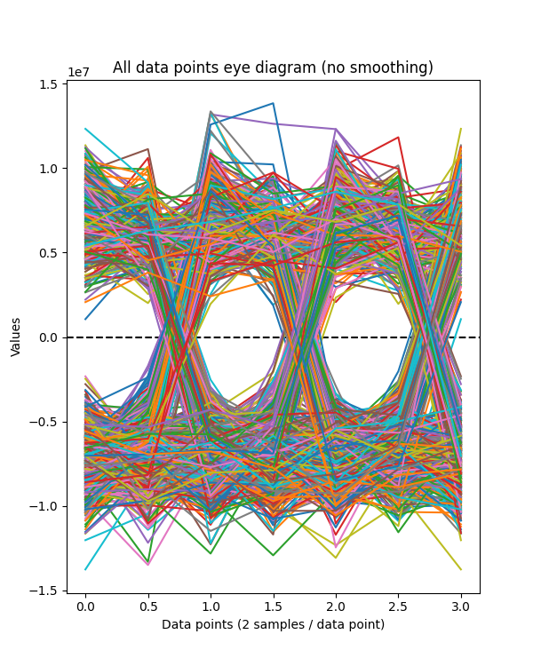

``--adps`` (all data points, smoothing) Same as above, but the data is
interpolated by 8 to present a smooth curve. Remember, the points between
the actual samples do not represent the truth, only an estimate.

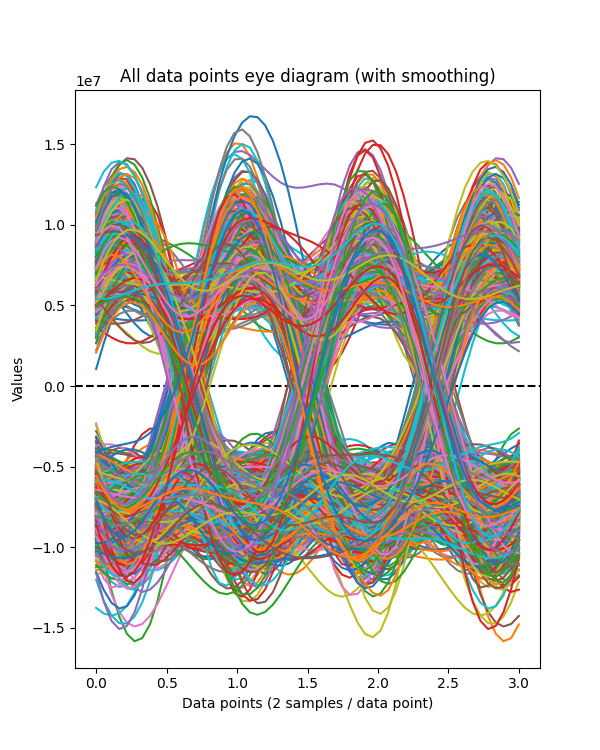

``--adpgfb`` (all data points, gradient, front to back) This is like
the previous diagram, but instead of using a different color for
each plot, we use a continuum of colors. The first part of the packet
starts off red, then gradually turns to yellow, then green, and finally blue.
Also, the transparency is changed to translucent, so you can see some of
the plots that have been overlayed. Because the color blue represents the
last of the plots, these eye-diagrams tend to hide the red and yellow colors.

By looking for outlier samples, you can tell what part of the packet
they came from. This can help in identifying burst errors.

These plots tend to emphasize data density since places where more data
occurs shows up denser. Outliers are still visible, but fainter. If you
are looking at a noisy signal, where there doesn't appear to be an eye
at all on the default plot, this plot can often delineate the eye.

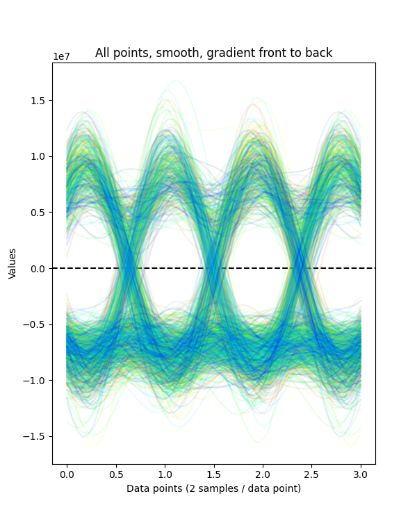

``--adpgbf`` (all data points, gradient, back to front) This is exactly
the same as the previous plot, except the last packet data is plotted first
and the first data is plotted last. Red still represents early data and
blue is late data. These will appear more reddish, since the red data is
plotted last.

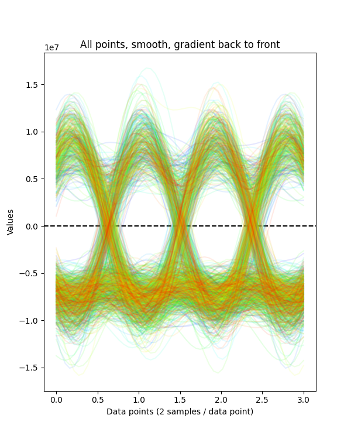

``--flns`` (first/last, no smoothing) First and last plots show only
the first 10% of the data and the last 10% of the data. All FIS-b
packets have some 1's and 0's at the front and the at the end (parity).
In the middle, they can be all zeroes (place-keeping packets).

This particular eye diagram uses gray for the early data and tan for the
last data. There is also some transparency applied. The main purpose is
to look for shifting from the beginning to the end of the packet, indicating
the sampling rate might be off.

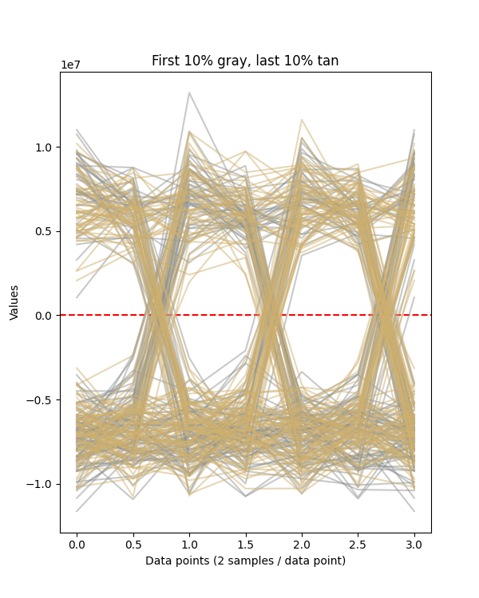

``--fls`` (first/last, smoothing) Same as the last diagram, except smooths
the packets and uses a different color for each data plot and no
transparency (same as
``--adpns``). If you have a very dense and noisy diagram, this can help
by only showing 20% of the data.

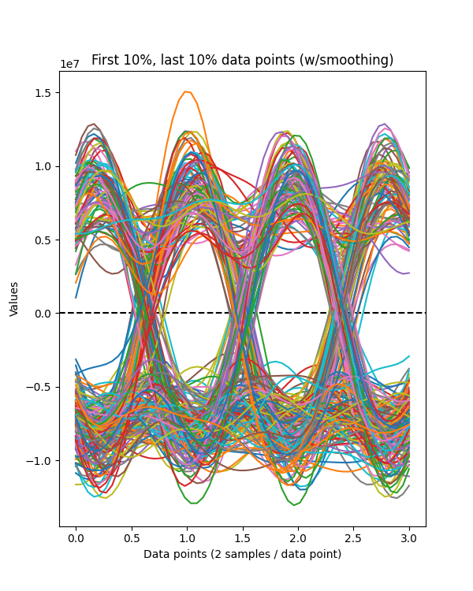

For reference purposes, here are examples from a FIS-B transmission received
a few hundred feet from a tower. These represent the 'gold standard' of 
reception.

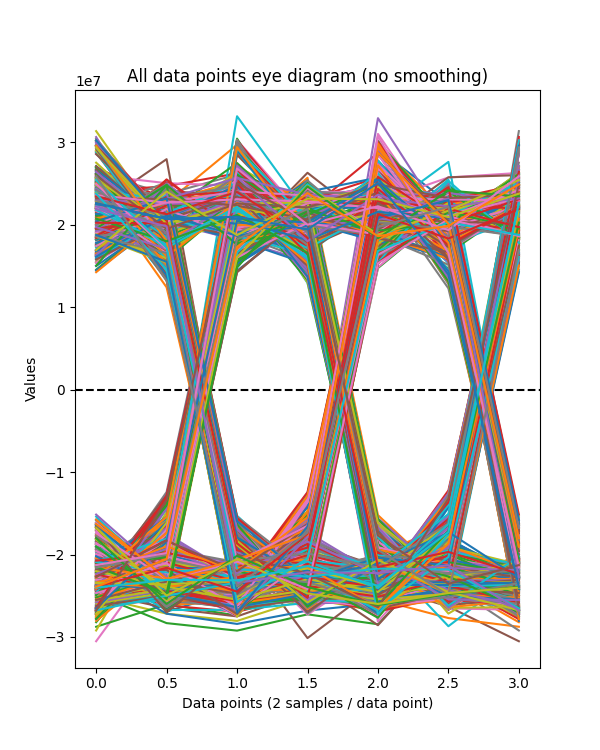
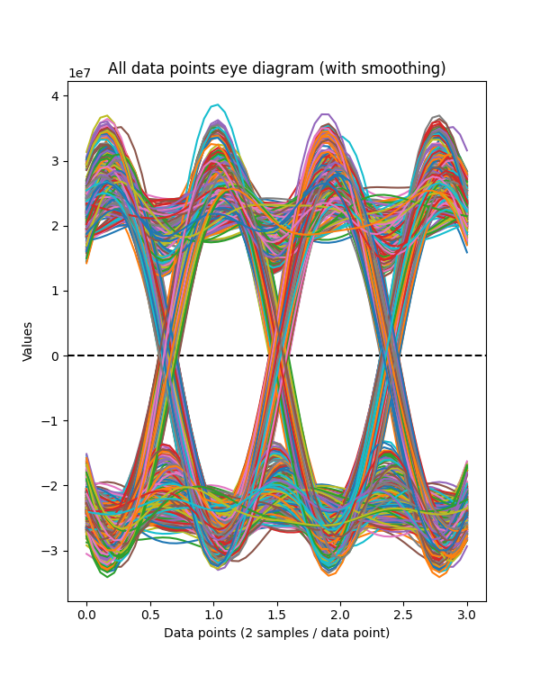
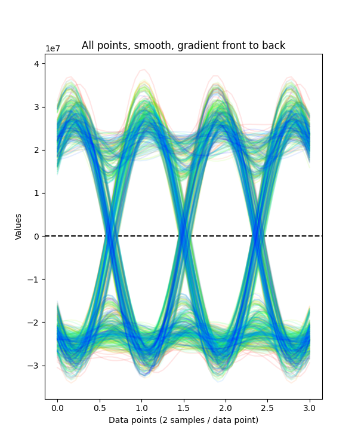
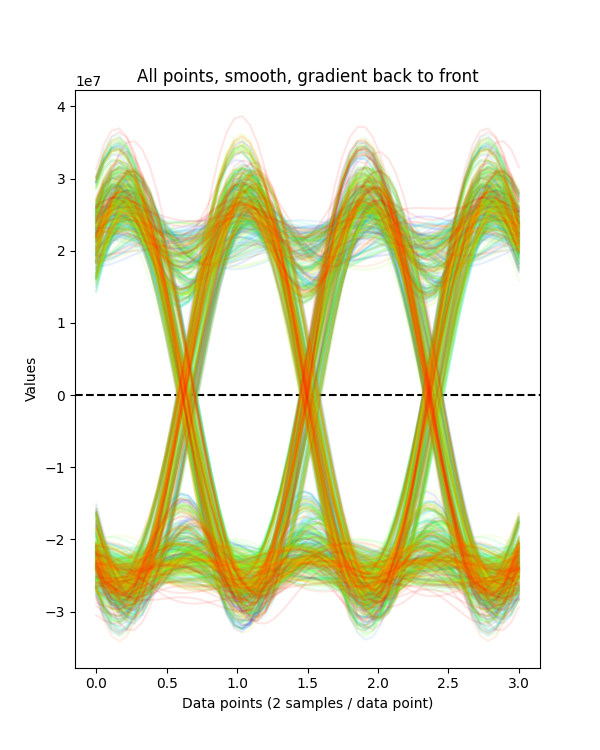
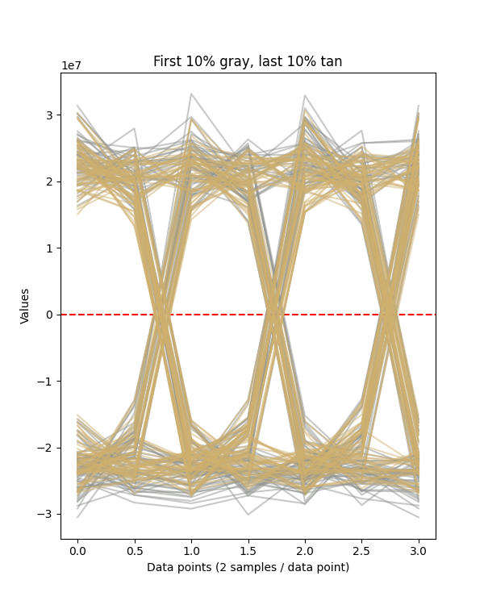
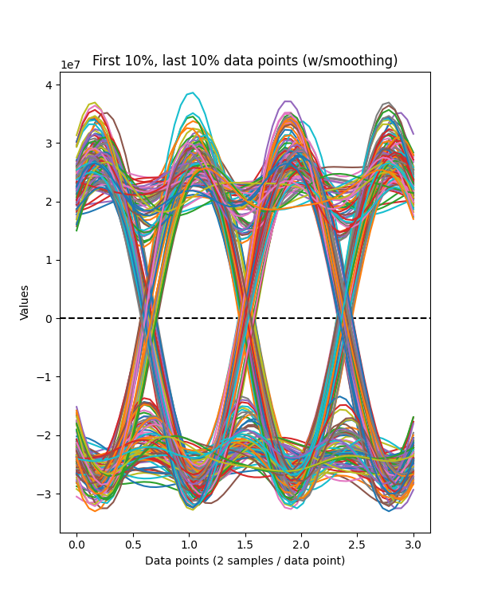

Building Documentation
======================

If you want to build the documentation, install
`sphinx <https://www.sphinx-doc.org/en/master/usage/installation.html>`_.
On Ubuntu 20.04 you can do this with: ::

  sudo apt install python3-sphinx

Next, install the Python requirements from the ``bin`` directory as: ::

  pip3 install -r ../misc/requirements-sphinx.txt

Next come the tricky parts. You will need to install
`doxygen <https://www.doxygen.nl/index.html>`_ and
`breathe <https://breathe.readthedocs.io/en/latest/>`_ on your
system. The setup for these is system dependent, so you need
to read and follow the documentation.

At a minimum, you will need to edit the file ``docs/source/conf.py``
and edit the line with ``breathe_projects`` and change the provided
path to reflect where ``doxygen/xml`` will be on your system.
This will normally be the path to where you cloned fisb-978
(i.e. ``~/fisb-978/doxygen/xml``).
The xml directory won't exist at first, but will be created the
first time you build the documentation. There is a doxygen
project file in ``doxygen/fisb_978``.

Then (assuming 'fisb-978' was cloned in your home directory): ::

  cd ~/fisb-978/docs
  ./makedocs

The html documentation will be found in ``fisb-978/docs/build/html``.
Load ``index.html`` in your browser to view. Sphinx is configured to
link directly to the source, so this is an easy way to explore the code.
